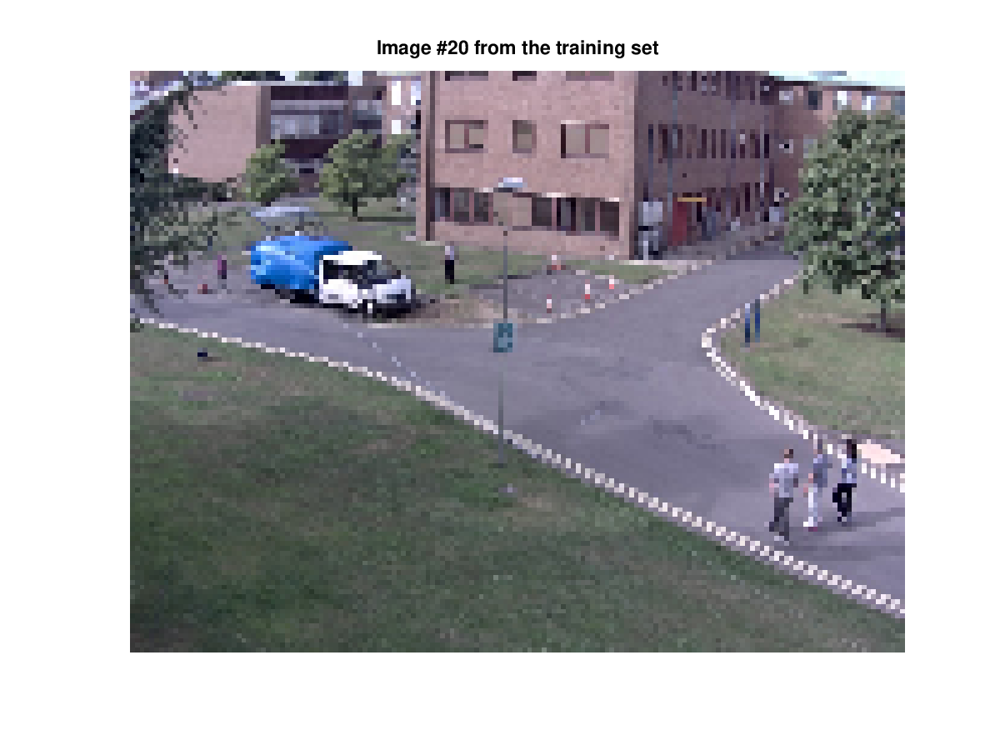
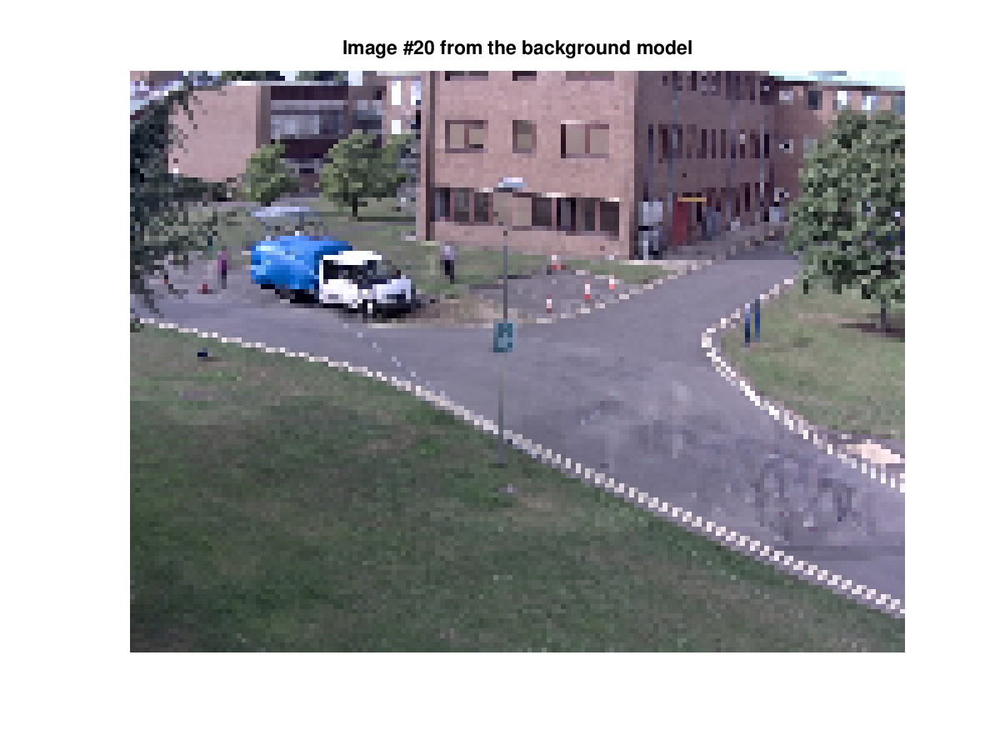
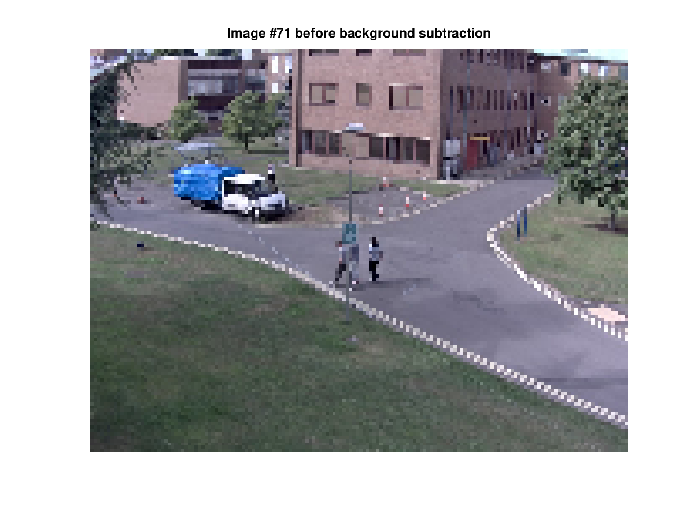
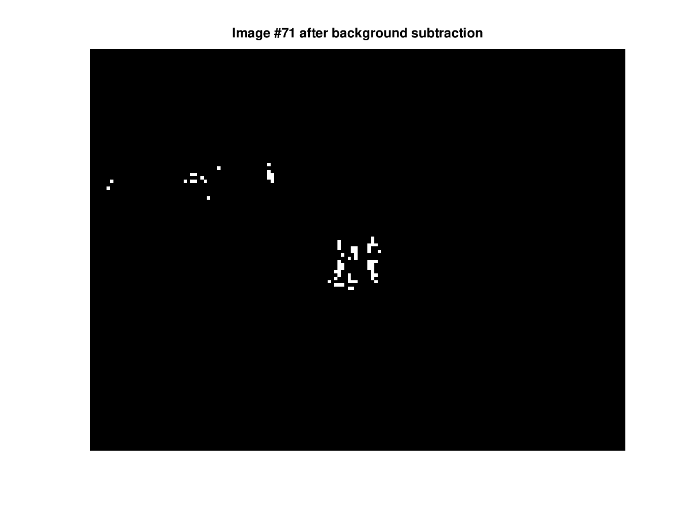

# Background subtraction with PCA
This code is an implementation of background subtraction with the PCA algorithm used for background modelling.

## Data
Images come from the ARENA-N1-01_02_ENV_RGB_3 train sequence of the PETS2017 dataset [1] (https://motchallenge.net/data/PETS2017/).

## Background modeling
Images are resized to prevent out of memory in Octave.

## Background subtraction

## Miscellaneous

### Should I center data before running PCA computation ?
- https://stats.stackexchange.com/questions/189822/how-does-centering-make-a-difference-in-pca-for-svd-and-eigen-decomposition
- https://stats.stackexchange.com/questions/22329/how-does-centering-the-data-get-rid-of-the-intercept-in-regression-and-pca

## Reference
[1] Patino, L., Cane, T., Vallee, A. & Ferryman, J. PETS 2016: Dataset and Challenge. In The IEEE Conference on Computer Vision and Pattern Recognition (CVPR) Workshops, 2016.
