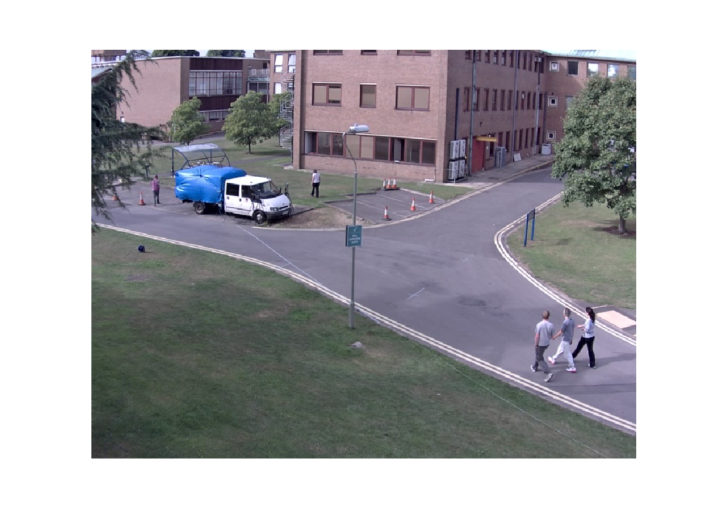
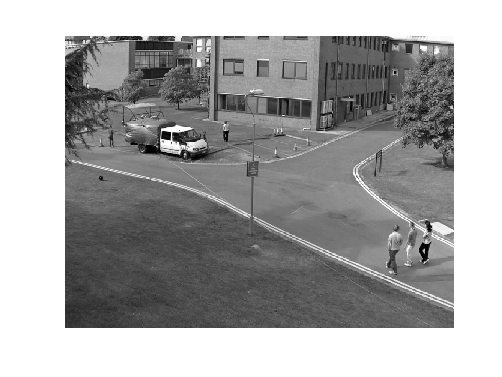
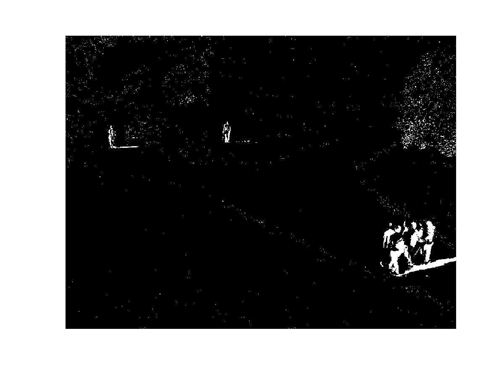
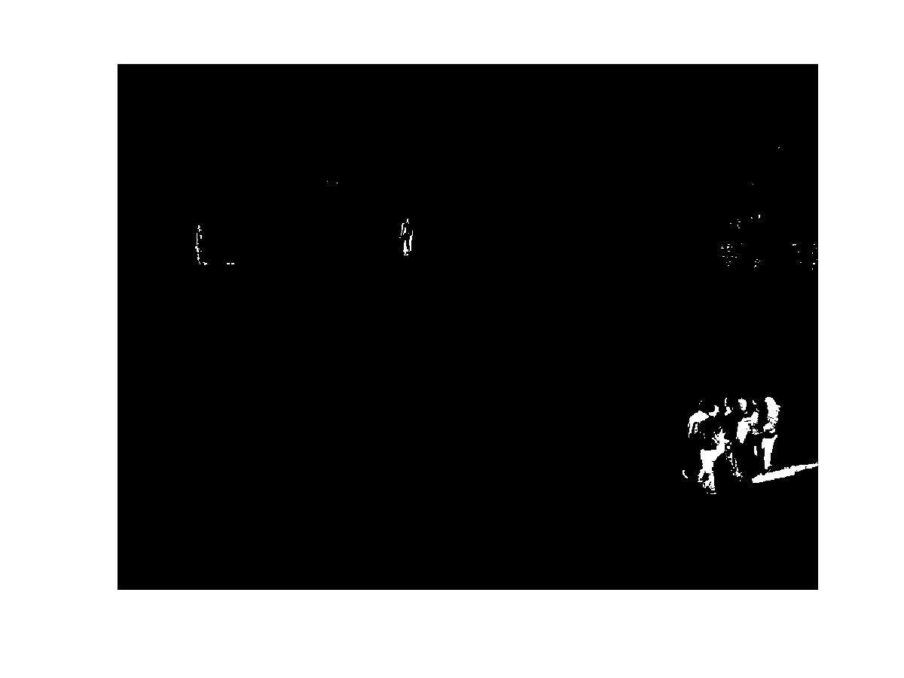
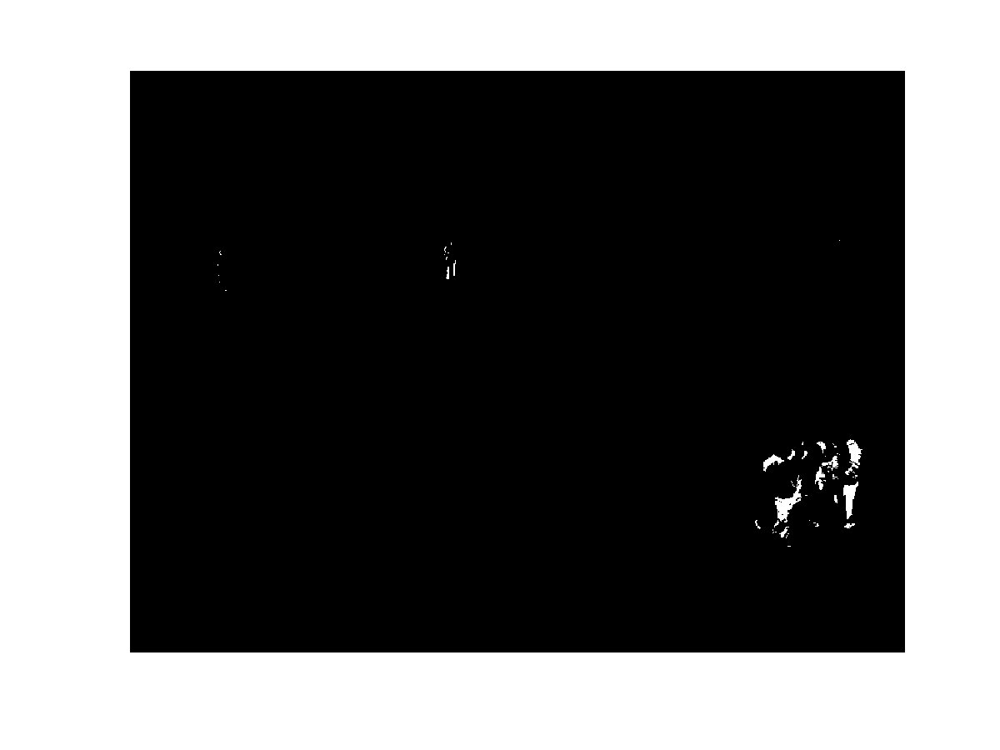

# Backgroung subtraction using frame differencing

## Data
Images come from the ARENA-N1-01_02_ENV_RGB_3 train sequence of the PETS2017 dataset [1] (https://motchallenge.net/data/PETS2017/).

## Background subtraction
The image at time  represents the background and the image at time  that will be compare to the background to extract moving objects (foreground).

Background image #20                    |  Current image #21
:--------------------------------------:|:-------------------------------------:
  |  

In order to subtract images and threshold them, they are convert to grayscale:

Background image grayscale #20               |  Current image grayscale #21
:-------------------------------------------:|:------------------------------------------:
 | 

Then, the frame differencing equation with a threshold is applied:

<a href="https://www.codecogs.com/eqnedit.php?latex=|I(x,y,t&plus;1)&space;-&space;I(x,y,t)|&space;>&space;threshold" target="_blank">&space;threshold" title="|I(x,y,t+1) - I(x,y,t)| > threshold" /></a>

Background subtraction mask #21                              |
:-----------------------------------------------------------:|
 |

## Results
Some results with different thresholds.

Threshold = 10                                  |  Threshold = 15
:----------------------------------------------:|:------------------------------------------:
 | 

Threshold = 30                                  |  Threshold = 60
:----------------------------------------------:|:------------------------------------------:
 | 

## Reference
[1] Patino, L., Cane, T., Vallee, A. & Ferryman, J. PETS 2016: Dataset and Challenge. In The IEEE Conference on Computer Vision and Pattern Recognition (CVPR) Workshops, 2016.
