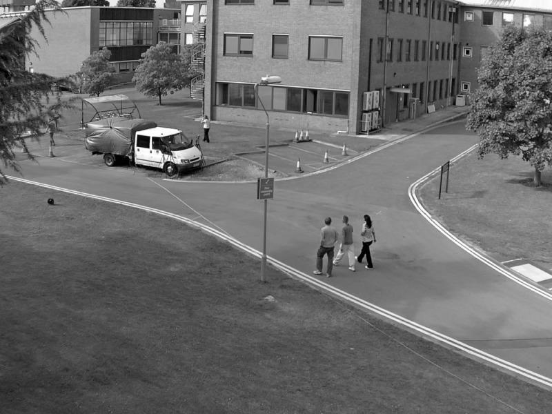
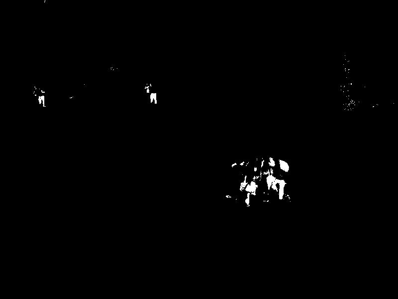
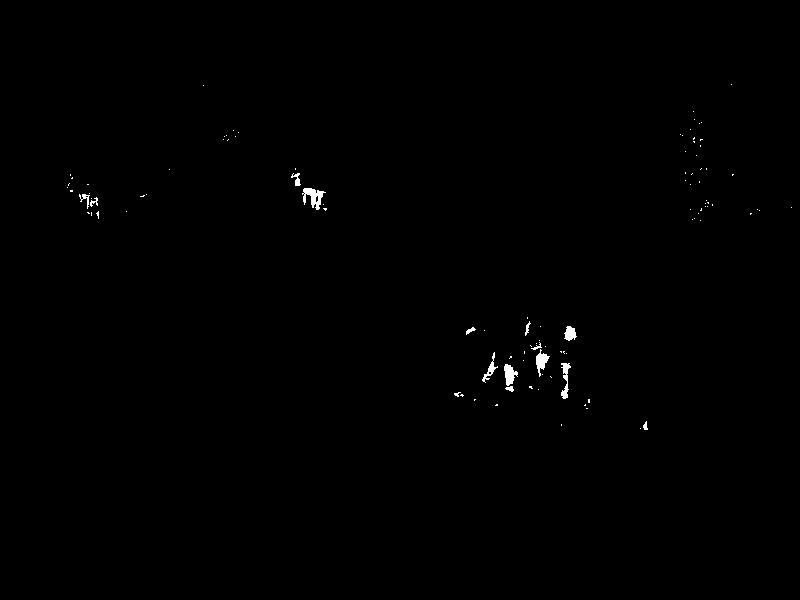
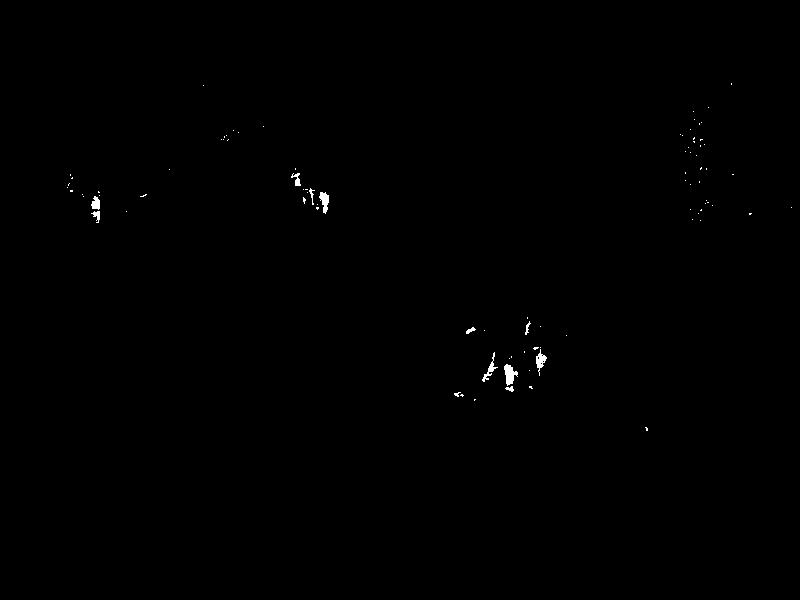
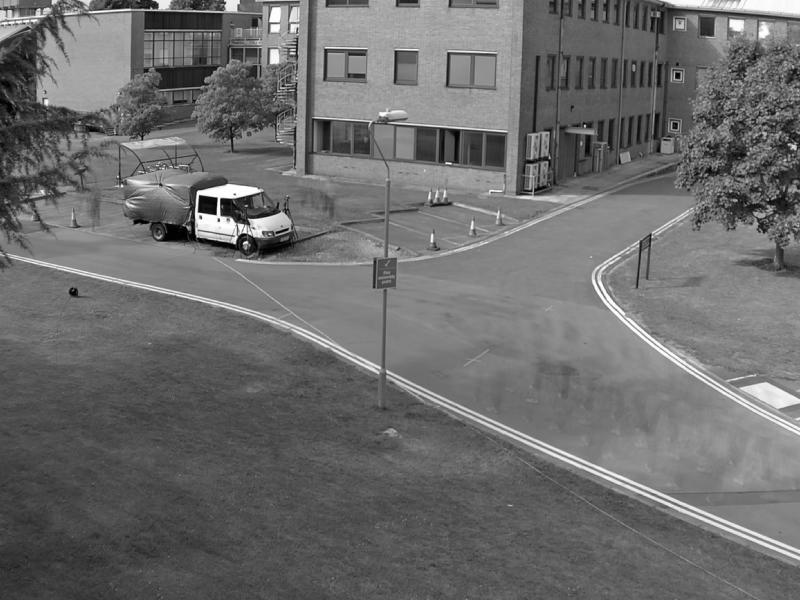
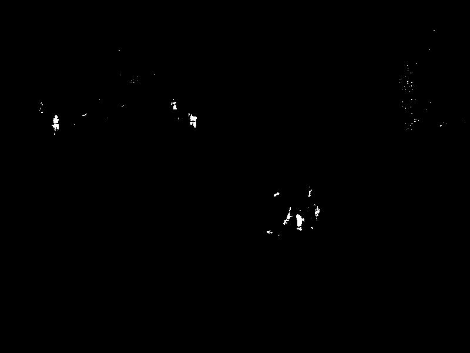

# Background subtraction using mean filtering

## Data
Images come from the ARENA-N1-01_02_ENV_RGB_3 train sequence of the PETS2017 dataset [1] (https://motchallenge.net/data/PETS2017/).

## Background subtraction
The background model is construct with the  previous images at time :

Current image rgb #50                    | Current image grayscale #50                          | Background image grayscale #50
:---------------------------------------:|:----------------------------------------------------:|:----------------------------------------:
 |  | 

The current image is then subtracted to the background model and thresholded:

<a href="http://www.codecogs.com/eqnedit.php?latex=|I(x,y,t)&space;-&space;B(x,y,t)|&space;>&space;threshold" target="_blank">&space;threshold" title="|I(x,y,t) - B(x,y,t)| > threshold" /></a>

## Results
Some results with different  values (here threshold = 20)

|      | Background model                              | Current image grayscale # 50                         | Mask
|:----:|:---------------------------------------------:|:----------------------------------------------------:|:-------------------------------------:
| n=10 |  |  | 
| n=20 |  |  | 
| n=30 |  |  | 
| n=40 |  |  | 

## Reference
[1] Patino, L., Cane, T., Vallee, A. & Ferryman, J. PETS 2016: Dataset and Challenge. In The IEEE Conference on Computer Vision and Pattern Recognition (CVPR) Workshops, 2016.
